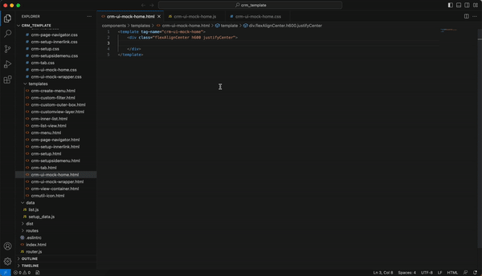

# VSR-Template-Helper

As a continution of VSR templates, we are happy to introducing the VSCode extension.  This extenstion fully loaded with the Lyte & Crux components and common css classes.

Note : This is the Beta mode Editor. we are still improving the extenstion. if you face any issues then please let us know we will fix in our next update.

## `Features`

What is VSR Template Helper?

“VSR Template Helper is an extenstion for VS Code text editors which greatly improves HTML & CSS workflow:”

And VSR Template Helper Extenstion does fulfill what they promise, you can use short expressions to generate HTML markup, CSS.

**Enjoy!**