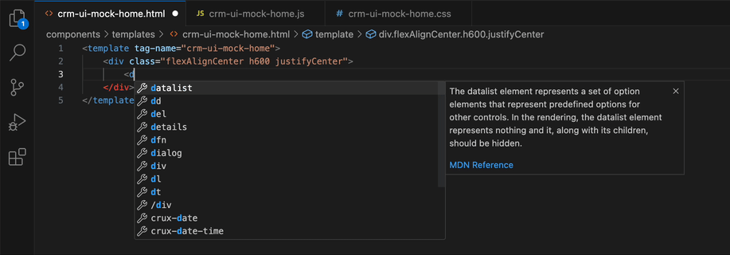
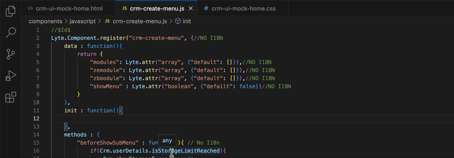

# VSR-Template-Helper

We're excited to present the VSCode addon. This extension comes pre-loaded with recommendations for `Lyte & Crux` components, `Base CSS` classes for HTML, `Util` javascript functions, `Color & Font` variables for Css, and Less.

## `Features`

What exactly is VSR Template Helper?

“The VSR Template Helper Extenstion for VS Code text editors significantly enhances HTML & CSS productivity. It delivers on its promise of allowing you to build HTML markup and CSS using simple expressions.

- Component from LYTE & CRUX with an attribute suggestion.

- Base file classes are loaded in advance for class attribute.

- Added suggestions for the utils and mask icons.

- Preloaded CRUX Utils for Javascript file.

- Css and Less file color variable suggestions are provided.

## `Overview of the extension`

This extension is suggested for use with Lyte & Crux components, Icons, and Base CSS classes for HTML.

This extension is suggested with util JavaScript functions, Colour & Font variables for CSS, and Less.

## `Help Docs`

- [LYTE References](https://lyte.csez.zohocorpin.com/home)
- [CRUX References](http://crux-components/component/introduction)
- [CRM UI Component Docs](http://zcrm-ui-imac:8888/Ui-team/GowriPrasanth/crm-ui-components/)
- [Color & Font Docs](http://zcrm-ui-imac:8888/Ui-team/Muneeshwaran/2021/crm-component-help-doc/)
- [Icon Docs](http://zcrm-ui-imac:8888/Ui-team/Muneeshwaran/2021/crm-icon-helpdoc/)

**`Enjoy!`**